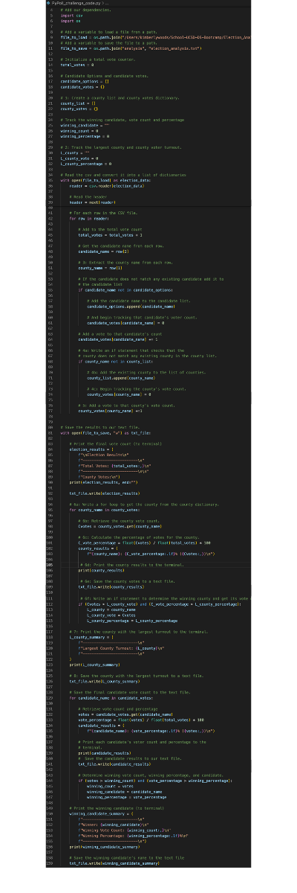

# Election_Analysis

## Overview of Election-Audit
This is an audit on the results of a congressional election in three Colorado counties. The analysis will include the following:

- Total number of votes cast.
- A complete list of all the counties that voted. 
- The number of votes cast in each county. 
- The percentage of votes cast in each county.
- The county that had the bast turnout. 
- A complete list of all the candidates. 
- The number of votes for each candidate. 
- The percentage of votes for each candidate.
- The winner on the election based on popular vote.

###   Resources 
- Data Source: [election_results.csv](Resources/election_results.csv)
- Software: Python 3.9.6, Visual Studio Code, 1.75.1

## Election-Audit Results: 

- Challenge Code
-- [PyPoll_challenge_code](PyPoll_challenge_code.py)
- Election Analysis Results
-- [analysis/election_analysis](analysis/election_analysis.txt)

The analysis of the election show that:

- There were 369,711 votes cast in the election
- The counties that participated were:
  - Jefferson County
  - Denver County
  - Arapahoe County
- The county results were:
  - Jefferson county received 10.5% of the vote and 38,855 number of votes. 
  - Denver county received 82.8% of the vote and 306,055 number of votes.
  - Arapahoe county received 6.7% of the vote and 24,801 number of votes.
- Denver had the largest voter turnout. 
- The candidates were:
  - Charles Casper Stockham 
  - Diana DeGette
  - Raymon Anthony Doane
- The candidate results were:
  - Charles Casper Stockham received 23.0% of the vote and 85,213 number of votes. 
  - Diana DeGette received 73.8% of the vote and 272,892 number of votes.
  - Raymon Anthony Doane received 3.1% of the vote and 11,606 number of votes.
- The winner of the election was:
  - Candidate Diana DeGette, who received 73.8% of the vote and 272,892 number of votes.

## Election-Audit Summary

In this analysis we were able to determine that Diana DeGette was the winner, and that Denver County had the largest turnout. 

Below you will see a snapshot of the code that was written to obtain these results from the csv file that was provided with the election results.  You will notice in the code that on lines 41-64 a ‘for loop’ with an ‘if’ statement was written to find the number of votes cast for each candidate. That “if” statement was then augmented to find the largest county turnout on lines 68-77. Then the percentage of votes was calculated. The winner of the election and the county with the best turnout was then determined and printed to our terminal and our results text file. 

This script can be used to replicate and analysis on another election quite easily. Modifications that would need to be made include where the data is pulling from and the text file you are then writing the results to. Another area that might need to be modified is on line 48 and 51 where we are specifying where in the dataset to pull the county names and the candidate names. 

## Code Image
[code](code.png)

